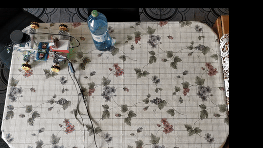
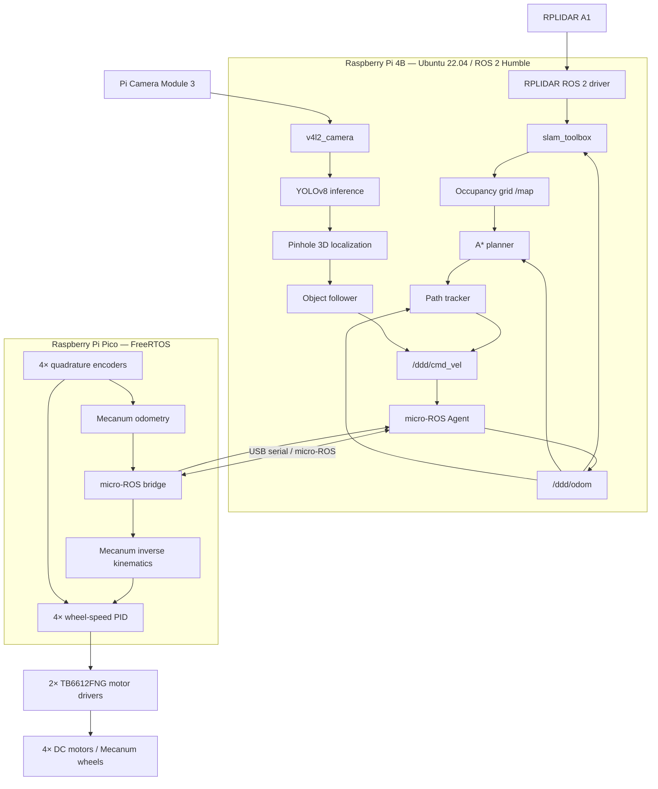

# Autonomous Omnidirectional Mobile Robot

**BSc Thesis — ROS 2, micro-ROS, Mecanum Drive, LiDAR SLAM and YOLOv8**

This project represents my introduction into the world of robotics and ROS. It represents a four-wheel Mecanum robot that plans collision-aware paths with A*, follows them using a Pure Pursuit omnidirectional controller, detects objects with YOLOv8 and estimates their 3D position from a calibrated camera. A Raspberry Pi 4B runs the ROS 2 autonomy and perception stack, while a Raspberry Pi Pico handles real-time encoder acquisition, wheel-speed control and Mecanum odometry over micro-ROS.

## Contents

- [Demo](#demo)
- [Technical Highlights](#technical-highlights)
- [My Contributions](#my-contributions)
- [System Architecture](#system-architecture)
- [Hardware](#hardware)
- [Installation & Usage](#installation--usage)


## Demo

### Perception-based autonomous navigation

The robot detects a target with YOLOv8, estimates its relative position and generates velocity commands on the physical Mecanum platform.

[](https://github.com/cristianooo1/mecanum_ros2_yolo/blob/main/gifs/inference_navigation_gif.gif)

### Obstacle-aware A* planning and path tracking

The occupancy grid derived from the LiDAR scan is inflated by the robot radius, the path is computed with A* and the Pure-Pursuit controller generated the omnidirectional velocity trajectory.

[](https://github.com/cristianooo1/mecanum_ros2_yolo/blob/main/gifs/pathtracking_navigation_gif.gif)

## Technical Highlights

- **Full-stack mobile robotics:** electronics, embedded firmware, ROS 2 integration, localization, planning, control and perception on a physical robot.
- **Holonomic motion:** custom four-wheel Mecanum inverse kinematics and encoder-based planar odometry, including lateral velocity.
- **Real-time low-level control:** FreeRTOS tasks on the Raspberry Pi Pico, four encoder feedback loops and micro-ROS transport.
- **Autonomous navigation:** RPLIDAR A1 data, `slam_toolbox`, an eight-connected A* planner and a Pure Pursuit omnidirectional path-tracking controller.
- **Edge perception:** a custom YOLOv8 model on Raspberry Pi camera images, ROS 2 detection messages and calibrated pinhole-camera object localization.
- **Custom electronics:** an EasyEDA-designed controller PCB that consolidates the Pico and low-level motor, encoder and communication wiring.

## My Contributions

The original DDD project supplied the starting point for Raspberry Pi Pico motor control and micro-ROS communication. I adapted that project and built the omnidirectional autonomy system around it.

| Area | My work | 
| --- | --- |
| Mecanum base | Adapted the firmware from two-wheel differential drive to four independently controlled Mecanum wheels; implemented holonomic kinematics and planar odometry |
| Embedded control | Integrated four encoder-feedback PID channels, FreeRTOS tasks, micro-ROS command/odometry exchange |
| Navigation | Implemented occupancy-grid A* planning and a Pure Pursuit omnidirectional path-tracking controller |
| Perception | Integrated YOLOv8 inference, custom ROS 2 detection messages, calibrated pinhole localization and target-following control | 
| ROS 2 integration | Created the robot description, launch/configuration files, custom messages and the odometry-to-`base_link` transform publisher |
| Hardware | Designed the custom controller PCB in EasyEDA and integrated the Raspberry Pi 4B, Raspberry Pi Pico, motor drivers, encoders, LiDAR and camera on the physical platform | 
| Validation | Tuned the wheel-speed PID controller, recorded raw test data and validated the navigation and perception pipelines on the robot |

## System Architecture



The Raspberry Pi 4B performs compute-intensive mapping, planning and perception. The Raspberry Pi Pico closes the motor-control loop near the hardware and exposes velocity commands, joint states and odometry to ROS 2 through the micro-ROS Agent.

## Hardware

| Subsystem | Components | Role |
| --- | --- | --- |
| Drive | 4× Mecanum wheels, 4× encoder-equipped DC motors | Holonomic translation and rotation |
| Motor power | 2× TB6612FNG dual motor-driver boards | Four independent bidirectional PWM channels |
| High-level computer | Raspberry Pi 4B | ROS 2, SLAM, planning, control, visualization and YOLOv8 inference |
| Real-time controller | Raspberry Pi Pico | Encoder acquisition, wheel PID, Mecanum kinematics/odometry and micro-ROS transport |
| Range sensing | RPLIDAR A1 | 2D scans for mapping and obstacle-aware planning |
| Vision | Raspberry Pi Camera Module 3 | RGB input for detection and monocular localization |
| Electronics | Custom PCB designed in EasyEDA | Consolidates Pico, motor-control, encoder and communication wiring |

### Custom controller PCB

I designed a custom PCB in EasyEDA to consolidate the Raspberry Pi Pico connections for four PWM motor channels, four quadrature encoders, status/communication signals and the external TB6612FNG power stages, simplifying assembly and debugging of the mobile base.


## Installation & Usage

### Tested environment

- Ubuntu 22.04 LTS on Raspberry Pi 4B
- ROS 2 Humble
- Raspberry Pi Pico SDK 

### 1. Clone the repository and submodules

```bash
cd "$HOME"
git clone --recurse-submodules https://github.com/cristianooo1/mecanum_ros2_yolo.git
cd mecanum_ros2_yolo
git submodule update --init --recursive
```

### 2. Install dependencies

Initialize `rosdep` once per every machine, then install dependencies:
```bash
sudo rosdep init 
rosdep update
source /opt/ros/humble/setup.bash
rosdep install --from-paths ROS_Implementation/ros2_ws/src --ignore-src -r -y
```

### 3. Build the ROS 2 workspace

```bash
cd ROS_Implementation/ros2_ws
source /opt/ros/humble/setup.bash
colcon build --symlink-install --packages-select droid1 tf_pub yolov8_msgs
source install/setup.bash
```

### 4. Build and flash the Raspberry Pi Pico firmware

Install the Raspberry Pi Pico SDK and set the `PICO_SDK_PATH`:

```bash
export PICO_SDK_PATH=/absolute/path/to/pico-sdk
cmake -S ROS_Implementation/firmware -B ROS_Implementation/firmware/build
cmake --build ROS_Implementation/firmware/build --parallel
```

Flash `ROS_Implementation/firmware/build/src/Motor.uf2` to the Pico in BOOTSEL mode.

### 5. Start the robot interfaces

Open separate terminals. In each one, source both ROS 2 and the workspace:

```bash
source /opt/ros/humble/setup.bash
source "$HOME/mecanum_ros2_yolo/ROS_Implementation/ros2_ws/install/setup.bash"
```

Then run:

```bash
# Terminal 1 — micro-ROS Agent
ros2 run micro_ros_agent micro_ros_agent serial --dev /dev/ttyACM0 -b 115200

# Terminal 2 — LiDAR
ros2 launch rplidar_ros rplidar_a1_launch.py

# Terminal 3 — robot description and RViz
ros2 launch droid1 dispOnly.launch.py

# Terminal 4 — odometry TF
ros2 run tf_pub tf_pub

# Terminal 5 — camera
ros2 run v4l2_camera v4l2_camera_node --ros-args \
  -p image_size:="[640,480]" \
  -p camera_frame_id:=camera_link_optical

# Terminal 6 — online SLAM
ros2 launch slam_toolbox online_async_launch.py use_sim_time:=false
```

### 6. Run obstacle-aware navigation

```bash
cd "$HOME/mecanum_ros2_yolo/ROS_Implementation/ros2_ws"
source install/setup.bash

# plan the path once from the current pose to a goal in the map frame
python3 src/yolobot_recognition/scripts/path_planning.py --ros-args \
  -p target_x:=0.8 \
  -p target_y:=-0.1

# follow the computed /planned_path 
python3 src/yolobot_recognition/scripts/pure_pursuit_omni.py
```

### 7. Run YOLOv8 localization and object following

```bash
# run the YOLOv8 detections
python3 src/yolobot_recognition/scripts/yolov8_ros2_pt.py

# run the 3D object pose estimate
python3 src/yolobot_recognition/scripts/detect_object_3D.py

# run the target following controller
python3 src/yolobot_recognition/scripts/AM_follower.py
```

The localization node assumes a 0.20 m known object size and contains camera intrinsics measured for this specific scenario. Recalibrate the camera and change `object_size`, `camera_matrix` and `distortion_coeffs` for another camera or target.
